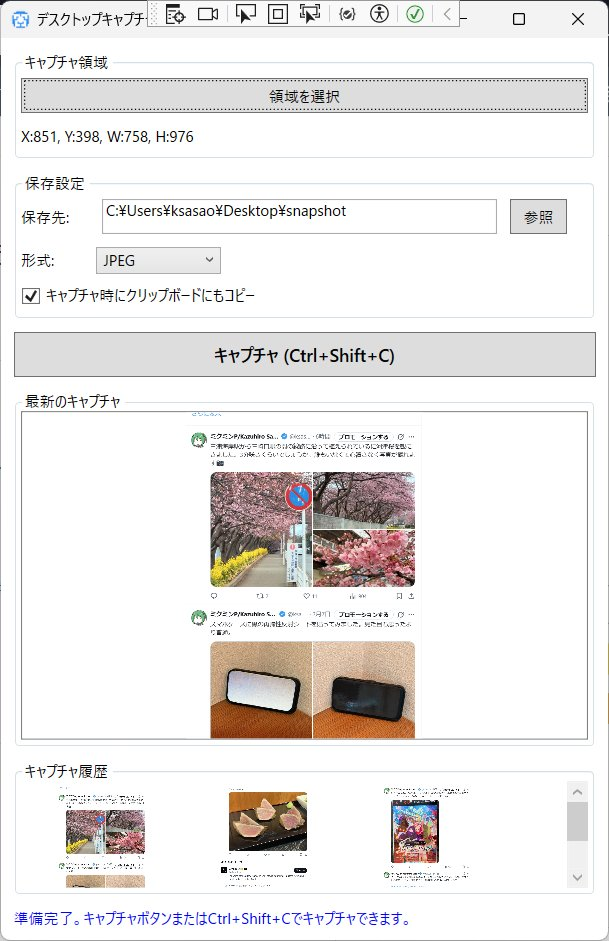

# DesktopCapture

デスクトップの特定領域をキャプチャして保存するWindowsアプリケーションです。



## 機能

- **領域選択キャプチャ**: デスクトップの任意の領域を選択してキャプチャ
- **座標表示**: 選択した領域の座標とサイズをリアルタイムで表示
- **複数の画像形式に対応**: JPEG、PNG形式で保存可能
- **クリップボード連携**: キャプチャした画像を自動的にクリップボードにコピー
- **グローバルホットキー**: `Ctrl + Shift + C` でどこからでもキャプチャ実行
- **キャプチャ履歴**: 最近キャプチャした画像を履歴として表示
- **設定の自動保存**: キャプチャ領域、保存先、画像形式などの設定を自動保存

## システム要件

- Windows 10/11
- .NET 8.0 Runtime

## 使い方

1. **領域の選択**
   - 「領域を選択」ボタンをクリック
   - マウスで画面上の任意の領域をドラッグして選択
   - 選択した領域の座標とサイズが表示されます

2. **保存設定**
   - 保存先フォルダを「参照」ボタンで選択
   - 画像形式（JPEG/PNG）を選択
   - 「キャプチャ時にクリップボードにもコピー」オプションを設定

3. **キャプチャの実行**
   - 「キャプチャ (Ctrl+Shift+C)」ボタンをクリック
   - または、グローバルホットキー `Ctrl + Shift + C` を使用

4. **キャプチャ履歴**
   - 最近キャプチャした画像が下部の履歴エリアに表示されます
   - 画像をクリックすると、画像がキャプチャ領域に表示されます

## ビルド方法
[Visual Studio 2026](https://visualstudio.microsoft.com/ja/downloads/)で```DesktopCapture.slnx```を開きビルドしてください。