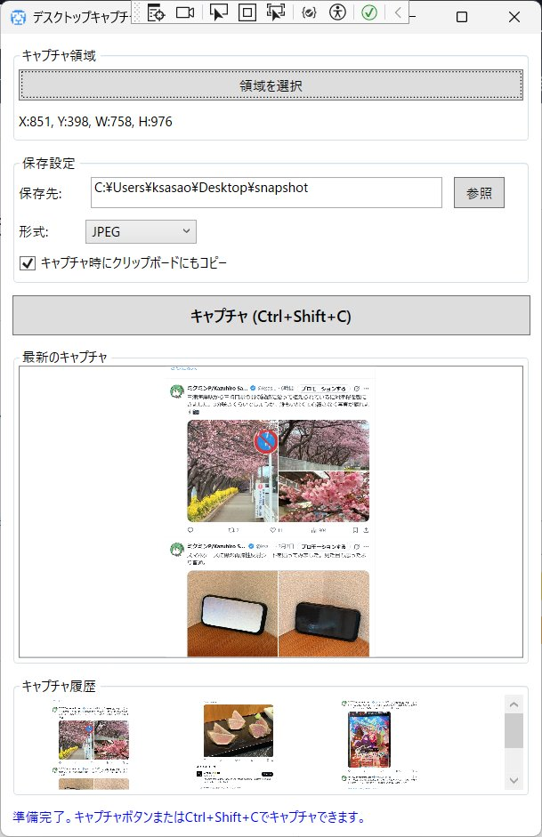

# DesktopCapture

デスクトップの特定領域をキャプチャして保存する Windows アプリケーションです。  
キャプチャ画像の OCR を実行し、Markdown 記録へ結果を追記できます。

## ダウンロード

- [DesktopCapture.1.0.9570.30526.zip](https://github.com/ksasao/DesktopCapture/releases/download/v1.0.9570/DesktopCapture.1.0.9570.30526.zip) (x64)
- [DesktopCapture.1.0.9570.41966_ARM64.zip](https://github.com/ksasao/DesktopCapture/releases/download/v1.0.9570/DesktopCapture.1.0.9570.41966_ARM64.zip) (ARM64)



## 機能

- **領域選択キャプチャ**: デスクトップの任意の領域を選択して同じ領域を連続的にキャプチャします
- **グローバルホットキー**: `Ctrl + Shift + C` でキャプチャが実行されます
- **メモ書き**: 画像の保存先に memo.md ファイルを自動作成して画像に対するメモを作成できます
- **OCR**: 「OCR」ボタンで選択したキャプチャ画像の文字認識結果をメモに挿入できます

## OCR の実装について

- OCR は Windows 11 の Snipping Tool (`Microsoft.ScreenSketch`) に含まれる `oneocr.dll` を使用
- 起動時に必要ファイルを実行フォルダ配下の `ocr-runtime` へ自動準備
  - `oneocr.dll`
  - `oneocr.onemodel`
  - `onnxruntime*.dll`
- Snipping Tool とアプリのアーキテクチャが不一致の場合、起動時に案内メッセージを表示

Snipping Tool の確認コマンド:

```powershell
Get-AppxPackage -Name Microsoft.ScreenSketch | Select-Object Name, Version, Architecture, InstallLocation
```

## システム要件

- Windows 11
- .NET 8 Runtime
- Snipping Tool (`Microsoft.ScreenSketch`)

## 使い方

1. **領域の選択**
   - 「領域を選択」をクリック
   - 画面上でドラッグして領域を選択

2. **保存設定**
   - 保存先フォルダを設定
   - ファイル名テンプレートを設定(ファイル名にはフォルダを含めることも可能)
   - 画像形式（PNG / JPEG）を選択
   - 必要に応じてクリップボードコピーを有効化

3. **キャプチャ実行**
   - 「キャプチャ (Ctrl+Shift+C)」をクリック
   - または `Ctrl + Shift + C` を使用

4. **記録（Markdown）**
   - 「画像タグを挿入」で最新画像タグを追記
   - 「OCR」で最新画像の OCR 結果を追記
   - 記録内容は `memo.md` に自動保存

## ビルド方法

### Visual Studio

[Visual Studio 2026](https://visualstudio.microsoft.com/ja/downloads/) で `DesktopCapture.slnx` を開いてビルドしてください。

### CLI（x64 / ARM64）

```powershell
dotnet publish .\DesktopCapture\DesktopCapture.csproj -c Release -r win-x64 --self-contained false
dotnet publish .\DesktopCapture\DesktopCapture.csproj -c Release -r win-arm64 --self-contained false
```

出力先:

- `DesktopCapture\bin\Release\net8.0-windows\win-x64\publish\`
- `DesktopCapture\bin\Release\net8.0-windows\win-arm64\publish\`
